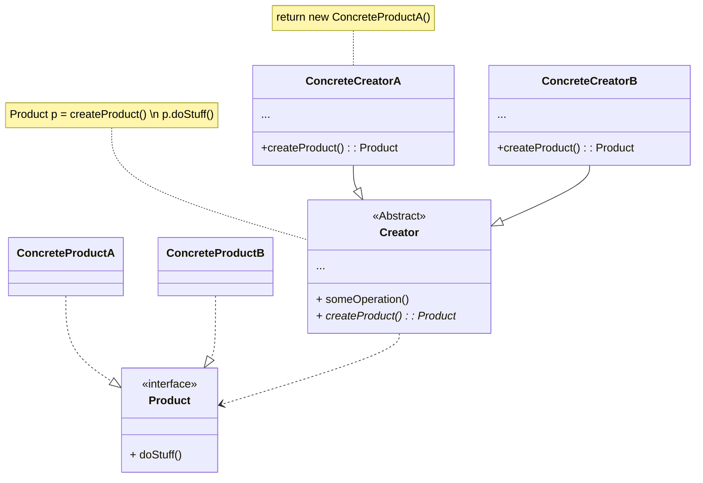
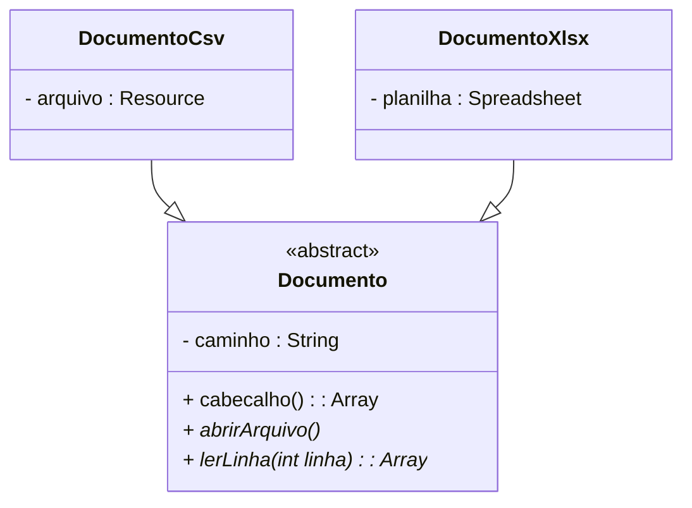
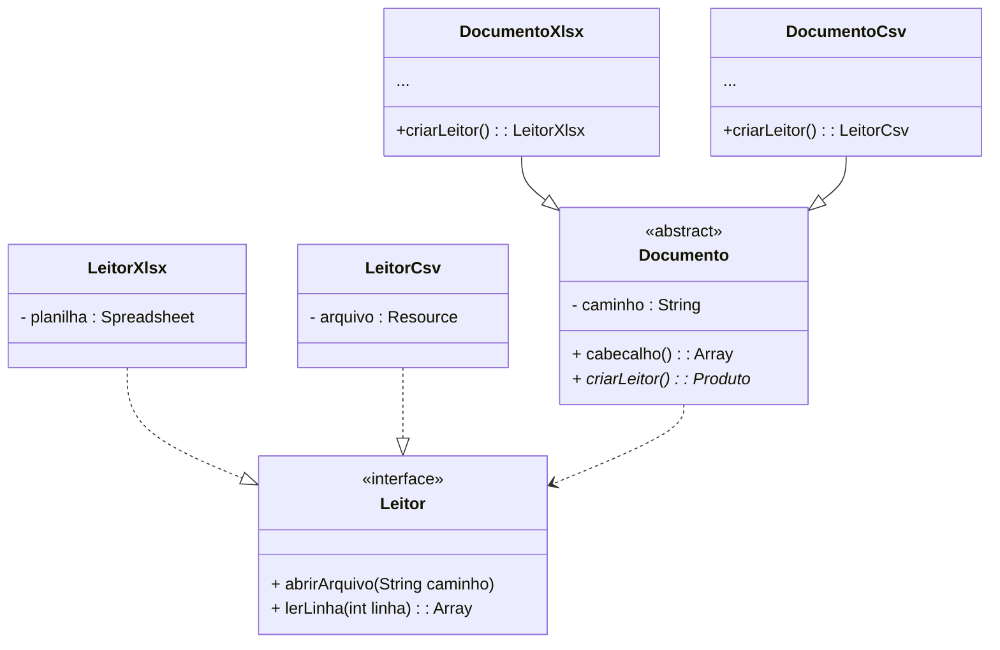

# Factory Method

## Descrição

O Factory Method é um padrão de projeto criacional

> Os padrões criacionais fornecem vários mecanismos de criação de objetos, que aumentam a flexibilidade e reutilização de código já existente.

De forma resumida, esse método fornece uma interface para criar objetos em uma superclasse, mas permite que as subclasses alterem o tipo de objetos que serão criados

## Funcionamento

O **Produto** declara a interface, que é comum a todos os objetos que podem ser produzidos pelo criador e suas subclasses.

**Produtos Concretos** são implementações diferentes da interface do produto

A classe **Criador** declara o método fábrica que retorna novos objetos produto. É importante que o tipo de retorno desse método corresponda à interface do produto.

**Criadores Concretos** sobrescrevem o método fábrica base para retornar um tipo diferente de produto.

### Exemplo

Quando estão procurando por *datasets*, cientistas de dados podem encontrá-los em diversos tipos de formatos. O objetivo aqui é construir uma solução que seja capaz de mostrar as colunas de cabeçalho de um determinado *dataset* que pode estar nos formatos xlsx ou csv.

#### Solução sem o Factory Method

#### Solução com o Factory Method

### Vantagens e desvantagens

#### Vantagens

- Você evita acoplamentos firmes entre o criador e os produtos concretos.

- Princípio de responsabilidade única. Você pode mover o código de criação do produto para um único local do programa, facilitando a manutenção do código.

- Princípio aberto/fechado. Você pode introduzir novos tipos de produtos no programa sem quebrar o código cliente existente.

#### Desvantagens

- O código pode se tornar mais complicado, pois você precisa introduzir muitas subclasses novas para implementar o padrão. O melhor cenário é quando você está introduzindo o padrão em uma hierarquia existente de classes criadoras.