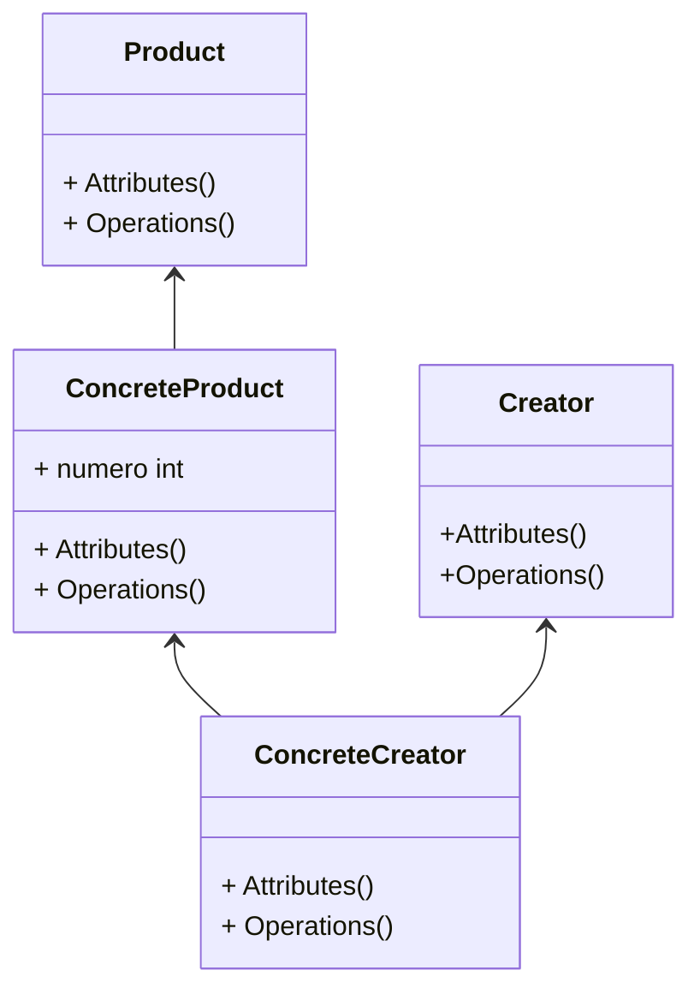

Factory Method - Método de Fábrica

Serve para definir uma interface para criar um objeto, mas deixando as subclasses decidirem qual classe instanciar.

"Fábricas são simplesmente operações que criam objetos."

- É um padrão de projeto de criação
- Oculta a lógica de instanciação do código cliente. O método fábrica será responsável or instanciar as classes desejadas
- É obtido através de herança. O método fábrica pode ser criado ou sobrescrito por subclasses
- Dá flexibilidade ao código cliente
[comment]: permitindo a criação de novas factories sem a necessidade de alterar código já escrito
- Pode usar parâmetros para determinar o tipo de objetos a serem criados ou os parâmetros a serem enviados aos objetos sendo criados

```javascript
type Car = {model: string; motor: string};
type CarPrototype = { showDetails(): void};

const carPrototype: CarPrototype = {
  showDetails(): void {
     console.log(this);
  },
};

const carFactory = (model: string, motor: string): Car & CarPrototype => {
  const idAsPrivateMember = Math.floor(Math.random() * 1000);
  const carObj = Object.create(carPrototype);
  return Object.assign(carObj, { id: idAsProvateMember, model, motor });
};

const carl = carFactory('Fusca', 'V8');
car1.showDetails(); // { id: 930, model: 'Fusca', motor: 'V8' }
const car2 = carFactory('Celta', 'ABDD1233');
car2.showDetails(); // { id: 672, model: 'Celta', motor: 'ABDD1233' }
```


```javascript
interface Product {
    sayHi(): void;
}

class ConcreteProduct implements Product {
    sayHi(): void {
        console.log('Hi');
    }
}

abstract class Creator {
    abstract factoryMethod(): Product;
    
    createAndShow(): void {
        const product = this.factoryMethod();
        console.log(product);
    }
}

class ConcreteCreator extends Creator {
    factoryMethod(): Product {
        return new ConcreteProduct();
    }
}

const creator = new ConcreteCreator();
const product = cretor.factoryMethod();
product.sayHi(); // Hi
creator.createAndShow(); // ConcreteProduct {}
```



